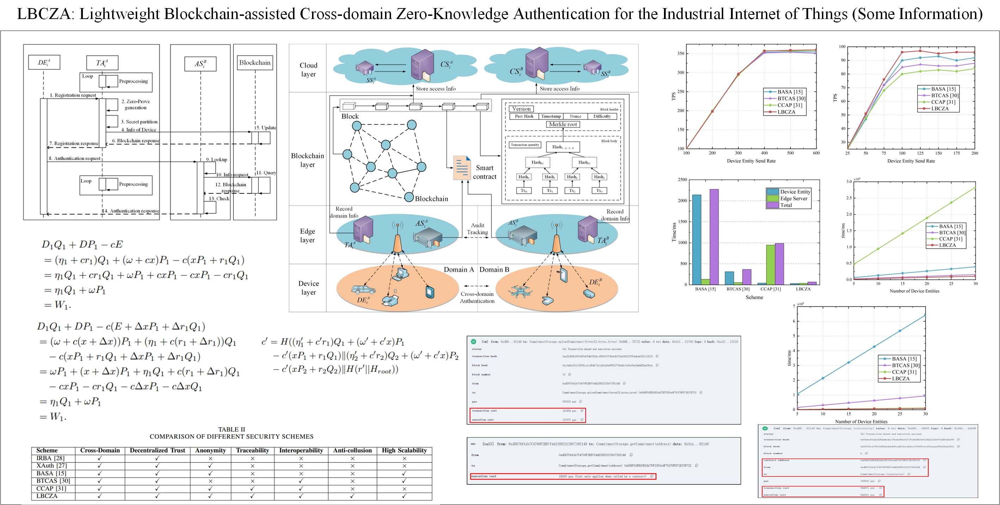

The main contributions of this paper are as follows:

(1)	We propose a lightweight blockchain-assisted cross-domain zero-knowledge authentication scheme for the Industrial Internet of Things (IIoT). The scheme can achieve flexible, lightweight access and audit trails across different domains for IoT devices with limited computing capabilities.

(2)	We propose to combine the Pedersen and the Fujisaki-Okamoto commitment protocol to design zero-knowledge cross-domain proofs. This effectively ensures anonymous access to cross-domain data by device entities and protects user information privacy. In addition, by using edge servers for preprocessing, the storage and computing overhead of resource-constrained device entities is significantly reduced.

(3)	We propose a cross-domain identity tracking protocol based on threshold variable secret sharing. This method uses binding value calculations and share generation to identify and track malicious devices while preventing colluders from manipulating secret shares to obtain the identities of legitimate devices through a dynamic threshold adjustment mechanism.

(4)	A comprehensive security analysis of the proposed scheme demonstrates its security and reliability, showing its ability to resist various types of attacks. Finally, performance evaluations indicate that the scheme outperforms other state-of-the-art schemes.

